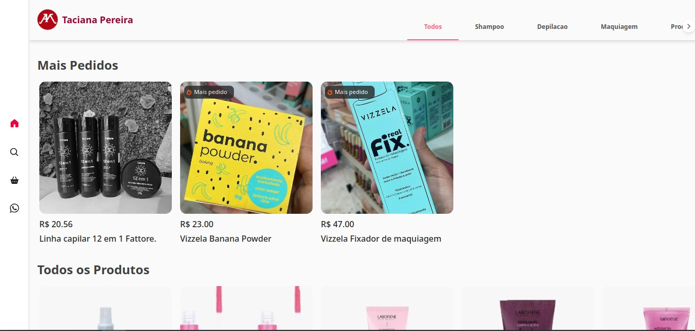

  

# Taciana Pereira | Vendedora Ofical da Montreal Distribuidora

     <a href="https://icarojordano.github.io/TacianaPereira/">📱 Visite o Projeto</a>

## 📝 Descrição do Projeto

Este é um *catálogo de vendas online, desenvolvido com foco em **navegação simples, busca rápida e experiência de compra fluida*. O projeto simula uma vitrine digital onde o usuário pode:

- *Navegar por categorias*
- *Pesquisar produtos pelo nome*
- *Filtrar resultados*
- *Adicionar itens ao carrinho*
- *Visualizar o total da compra em tempo real*
- *Finalizar o pedido via link direto para o WhatsApp*

O objetivo é oferecer uma solução leve e funcional para negócios que querem *vender online sem precisar de um e-commerce completo*. Essa interface pode ser adaptada facilmente para lojas físicas, vendedores autônomos ou catálogos de serviços e produtos personalizados.

---

### O que esse projeto resolve

- Organiza produtos de forma clara e acessível  
- Torna o processo de compra mais rápido e objetivo  
- Elimina a necessidade de login ou sistemas complexos  
- Conecta diretamente com o vendedor via WhatsApp

## 💻 Tech Stack

<!--- # "Verify icons availability here https://github.com/tandpfun/skill-icons" -->

<h2 id="layout">🎨 Layout</h2>

    
    

## 🧩 Features

- [x] Busca de produtos com filtros dinâmicos
- [x] Cards de produto com imagem e informações principais
- [x] Página de detalhes do produto
- [x] Layout responsivo (mobile-first)
- [x] Navegação por rotas com carregamento instantâneo
- [X] Funcao de adicionar ao carrinho 
- [x] Feedback visual de carregamento
- [X] Finalizar o pedido via link direto para o WhatsApp

<h2 id="colab">🤝 Collaborators</h2>

Agradecimento especial a todas as pessoas que contribuíram para este projeto.

<table>
  <tr>
    <td align="center">
      <a href="#">
         
        
          <b>Icaro Jordano | Desenvolvedor 
            e Tech Manager</b>
        
      </a>
    </td>
    
  </tr>
</table>
